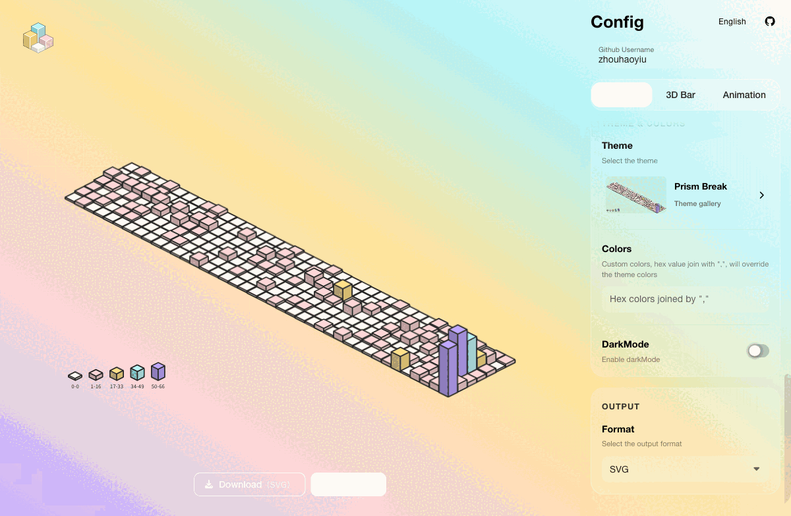

<div align="center">
  <h1>ssr-contributions-img</h1>
  <p>Render GitHub contribution history as SVG charts for READMEs, profile pages, and widgets.</p>
  <p>
    <a href="./README.md">简体中文</a>
    ·
    <strong>English</strong>
    ·
    <a href="./README-JA.md">日本語</a>
  </p>
  <p>
    <a href="https://ssr-contributions-img.zhouhaoyiu.workers.dev/health">Live service</a>
    ·
    <a href="#quick-start">Quick start</a>
    ·
    <a href="#configuration">Configuration</a>
    ·
    <a href="#local-development">Local development</a>
  </p>
  <picture>
    <source media="(prefers-color-scheme: dark)" srcset="https://ssr-contributions-img.zhouhaoyiu.workers.dev/_/zhouhaoyiu?chart=3dbar&amp;format=svg&amp;weeks=42&amp;animation=wave&amp;theme=prism_break&amp;dark=true&amp;gradient=true&amp;legend=true&amp;legendPosition=bottom&amp;legendDirection=row">
    <source media="(prefers-color-scheme: light)" srcset="https://ssr-contributions-img.zhouhaoyiu.workers.dev/_/zhouhaoyiu?chart=3dbar&amp;format=svg&amp;weeks=42&amp;animation=wave&amp;theme=prism_break&amp;dark=false&amp;gradient=true&amp;legend=true&amp;legendPosition=bottom&amp;legendDirection=row">
    
  </picture>
</div>

## Features

- `calendar` and `3dbar` chart layouts
- 53 preset themes and custom hexadecimal palettes
- Six SVG animations: `fall`, `raise`, `wave`, `mess`, `spin`, and `fadeIn`
- Gradient fills, legends, strokes, lighting, spacing, and flattening for 3D bars
- A Cloudflare Worker endpoint for SVG images
- A Nest API with `svg`, `xml`, `html`, `png`, and `jpeg` output
- A Vue playground for previewing, configuring, downloading, and copying chart links

## Quick start

Worker URL:

```text
https://ssr-contributions-img.zhouhaoyiu.workers.dev/_/{username}?{queryString}
```

Minimal example:

```text
https://ssr-contributions-img.zhouhaoyiu.workers.dev/_/zhouhaoyiu?chart=3dbar&format=svg
```

Embed a chart in a GitHub README:

```md

```

Replace `zhouhaoyiu` in the URL with another GitHub username. The Worker caches responses for five minutes, and GitHub's image proxy may keep its own cached copy longer.

## Playground

The Vue playground previews the chart, switches themes, edits parameters, downloads SVG files, and copies chart links.

<picture>
  <source media="(prefers-color-scheme: dark)" srcset="./assets/screenshots/playground-en-dark.gif">
  <source media="(prefers-color-scheme: light)" srcset="./assets/screenshots/playground-en-light.gif">
  
</picture>

## Examples

### GitHub-style calendar

```text
https://ssr-contributions-img.zhouhaoyiu.workers.dev/_/zhouhaoyiu?chart=calendar&format=svg&weeks=50&theme=native
```

<picture>
  <source media="(prefers-color-scheme: dark)" srcset="https://ssr-contributions-img.zhouhaoyiu.workers.dev/_/zhouhaoyiu?chart=calendar&amp;format=svg&amp;weeks=50&amp;theme=native&amp;dark=true">
  <source media="(prefers-color-scheme: light)" srcset="https://ssr-contributions-img.zhouhaoyiu.workers.dev/_/zhouhaoyiu?chart=calendar&amp;format=svg&amp;weeks=50&amp;theme=native&amp;dark=false">
  
</picture>

### Animated 3D bars with a legend

```text
https://ssr-contributions-img.zhouhaoyiu.workers.dev/_/zhouhaoyiu?chart=3dbar&format=svg&weeks=42&theme=prism_break&gradient=true&strokeWidth=1&legend=true&legendPosition=bottom&legendDirection=row&animation=wave
```

<picture>
  <source media="(prefers-color-scheme: dark)" srcset="https://ssr-contributions-img.zhouhaoyiu.workers.dev/_/zhouhaoyiu?chart=3dbar&amp;format=svg&amp;weeks=42&amp;theme=prism_break&amp;gradient=true&amp;strokeWidth=1&amp;legend=true&amp;legendPosition=bottom&amp;legendDirection=row&amp;animation=wave&amp;dark=true">
  <source media="(prefers-color-scheme: light)" srcset="https://ssr-contributions-img.zhouhaoyiu.workers.dev/_/zhouhaoyiu?chart=3dbar&amp;format=svg&amp;weeks=42&amp;theme=prism_break&amp;gradient=true&amp;strokeWidth=1&amp;legend=true&amp;legendPosition=bottom&amp;legendDirection=row&amp;animation=wave&amp;dark=false">
  
</picture>

### Custom palette

`colors` overrides `theme`. Omit the `#` prefix and separate colors with commas:

```text
https://ssr-contributions-img.zhouhaoyiu.workers.dev/_/zhouhaoyiu?chart=3dbar&format=svg&weeks=36&colors=0b132b,1c2541,3a506b,5bc0be,6fffe9&gradient=true
```

### Animation examples

<table>
  <tr>
    <th><code>fall</code></th>
    <th><code>raise</code></th>
    <th><code>wave</code></th>
  </tr>
  <tr>
    <td></td>
    <td></td>
    <td></td>
  </tr>
</table>

### Two flatten modes

<table>
  <tr>
    <th><code>flatten=1</code></th>
    <th><code>flatten=2</code></th>
  </tr>
  <tr>
    <td></td>
    <td></td>
  </tr>
</table>

## Runtime options

| Capability | Cloudflare Worker | Nest API |
| --- | --- | --- |
| Best for | GitHub READMEs, profile pages, public image URLs | Playground, full API, self-hosting |
| Chart routes | `/_/:username`, `/svg/:username` | `/_/:username`, `/svg/:username` |
| Output | SVG only | `svg`, `xml`, `html`, `png`, `jpeg` |
| Other routes | `/health` | `/themes`, `/config`, `/contributions/:username` |
| Address | `ssr-contributions-img.zhouhaoyiu.workers.dev` | Local or self-hosted |

The Worker reads GitHub's public contribution page. The Nest API uses the same source first and can fall back to GraphQL when `GITHUB_PAT` is configured.

## Configuration

Pass options in the URL query string. Booleans use `true` or `false`. Hex colors should omit `#` so the URL fragment marker does not interfere with parsing.

The endpoint exposes 28 query parameters in three groups.

| Group | Count | Parameters |
| --- | ---: | --- |
| General | 9 | `chart`, `theme`, `colors`, `dark`, `widget_size`, `weeks`, `tz`, `format`, `quality` |
| 3D bars | 11 | `gap`, `scale`, `light`, `gradient`, `flatten`, `legend`, `legendPosition`, `legendDirection`, `foregroundColor`, `strokeWidth`, `strokeColor` |
| Animation | 8 | `animation`, `animation_duration`, `animation_delay`, `animation_amplitude`, `animation_frequency`, `animation_wave_center`, `animation_loop`, `animation_reverse` |

Set `tz` directly in the URL. The playground shows `animation_loop` and `animation_reverse` only for the animation modes that use them, so all 28 options are not visible at once.

### Common options

| Parameter | Values | Default | Description |
| --- | --- | --- | --- |
| `chart` | `calendar`, `3dbar` | Worker: `3dbar`; Nest: `calendar` | Chart layout |
| `theme` | Preset name or `random` | `green` | `random` selects a palette for each render |
| `colors` | Comma-separated hex colors | Not set | Custom palette; overrides `theme` |
| `dark` | `true`, `false` | `false` | Use the dark variant of a theme |
| `widget_size` | `small`, `medium`, `large` | `medium` | Select 7, 16, or 40 weeks respectively |
| `weeks` | `1` to `50` | From `widget_size` | Set the week count and override `widget_size` |
| `tz` | IANA time zone, such as `Asia/Shanghai` | `Asia/Shanghai` | Time zone used to calculate the current date |
| `format` | `svg`, `xml`, `html`, `png`, `jpeg` | Nest: `html` | The Worker always returns SVG; other formats require the Nest API |
| `quality` | `0.1` to `10` | `1` | Output scale for PNG and JPEG |

### 3D bar options

These options apply only when `chart=3dbar`.

| Parameter | Values | Default | Description |
| --- | --- | --- | --- |
| `gap` | `0` to `20` | `1.2` | Space between cubes |
| `scale` | `1` or greater | `2` | Isometric skew; the playground limits it to 100 |
| `light` | `1` to `60` | `10` | Shading contrast between cube faces |
| `gradient` | `true`, `false` | `false` | Use gradient fills |
| `flatten` | `0`, `1`, `2` | `0` | `0` keeps height, `1` flattens all cubes, `2` omits empty cubes |
| `legend` | `true`, `false` | `false` | Show contribution ranges; the legacy `lengend` alias is accepted |
| `legendPosition` | `top`, `right`, `bottom`, `left`, `topRight`, `bottomLeft` | `right` | Legend placement |
| `legendDirection` | `row`, `column` | `column` | Horizontal or vertical legend layout |
| `foregroundColor` | Hex color | Automatic | Legend text; defaults to `#222` in light mode and `#ddd` in dark mode |
| `strokeWidth` | `0` to `20` | `0` | Cube outline width; `0` disables outlines |
| `strokeColor` | Hex color | Automatic | Cube outline color; setting only this option uses a width of `1` |

### Animation options

Animations apply to 3D SVG output. The Nest API removes animation when producing PNG or JPEG files.

| Parameter | Values or format | Default | Description |
| --- | --- | --- | --- |
| `animation` | `fall`, `raise`, `wave`, `mess`, `spin`, `fadeIn`, `none` | Not set | Animation type |
| `animation_duration` | Seconds | Depends on animation | Duration of one animation cycle |
| `animation_delay` | Seconds | Depends on animation | Delay between cubes |
| `animation_amplitude` | Pixels | `10` | Vertical amplitude for `wave` |
| `animation_frequency` | `0.01` to `0.5` | `0.05` | Frequency for `wave` |
| `animation_wave_center` | `weekIndex_dayIndex`, such as `19_3` | `0_0` | Origin of the `wave` animation |
| `animation_loop` | `true`, `false` | `false` | Loop `mess` or `spin`; `wave` always loops |
| `animation_reverse` | `true`, `false` | `false` | Reverse the cube order for `fadeIn` |

Without timing parameters, `fall` and `raise` use 1 second, `wave`, `mess`, and `spin` use 3 seconds, and `fadeIn` uses 0.5 seconds.

### Themes

The renderer includes 53 fixed themes and a `random` mode.

<details>
  <summary>Show every theme name</summary>

Basic themes:

```text
green, dark_green, red, purple, blue, yellow, cyan, yellow_wine, pink, sunset, native
```

Extended themes:

```text
purple_nebula, blue_orbit, sunset_ember, teal_lagoon, rose_pulse,
amber_forge, emerald_canopy, cyan_depth, indigo_night, mono_slate,
neon_horizon, aurora_drift, lava_surge, frost_byte, acid_rain,
volt_riot, toxic_glitch, plasma_storm, chrome_pulse, cyber_sakura,
obsidian_bloom, desert_mirage, hologram_pop, circuit_bronze, lotus_eclipse,
tropic_burst, deco_nights, supernova_crash, vaporwave_dream, quantum_leap,
dragonfire_scales, halloween_pumpkin, nordic_frost, cosmic_latte, tokyo_night,
autumn_maple, laser_grid, blacklight, prism_break, matrix_rain,
solar_flare, ocean_reactor
```

</details>

The full Nest API can render all themes on one page:

```text
http://localhost:3000/themes?format=svg
http://localhost:3000/themes?format=svg&dark=true
```

## Local development

Requirements: Node.js `22.x` or `26.x`, and pnpm `11.15.1`.

```shell
pnpm install
```

Terminal 1: start the Nest API. `PLAYGROUND_ALLOWED_ORIGINS` must include the browser origin used by the playground, or the data endpoint returns `403 Origin not allowed`.

```shell
PLAYGROUND_ALLOWED_ORIGINS=http://localhost:5173 SERVER_PORT=3000 pnpm start:dev
```

Terminal 2: start the Vue playground.

```shell
VITE_DEV_SERVER_PROXY_TARGET=http://localhost:3000 pnpm -C playground dev
```

Open `http://localhost:5173`. You can also call the API directly:

```text
http://localhost:3000/_/zhouhaoyiu?chart=3dbar&format=svg&weeks=40&theme=prism_break
```

### Environment variables

| Variable | Default | Description |
| --- | --- | --- |
| `SERVER_PORT` | `3000` | Nest API port |
| `GITHUB_PAT` | Not set | Optional GraphQL fallback and diagnostics when the public contribution page is unavailable |
| `PLAYGROUND_ALLOWED_ORIGINS` | Not set | Browser origins allowed to call the playground data endpoint; separate multiple origins with commas |
| `PLAYGROUND_DATA_RATE_LIMIT_MAX` | `30` | Requests allowed for one IP and username during a rate-limit window |
| `PLAYGROUND_DATA_RATE_LIMIT_WINDOW_MS` | `60000` | Rate-limit window in milliseconds |
| `PLAYGROUND_DATA_CACHE_TTL_MS` | `300000` | Contribution and render cache lifetime in milliseconds |

### Build and test

```shell
pnpm build
pnpm test --runInBand
```

## Deployment

The Cloudflare Worker entry point is `worker/index.ts`, with settings in `wrangler.toml`. Its root route redirects to the repository page.

The Nest/Vercel entry point is `api/index.ts`, with settings in `vercel.json`. Use this deployment for PNG, JPEG, HTML, the theme overview, or the full playground API.

## Acknowledgements

Thanks to [CatsJuice/ssr-contributions-img](https://github.com/CatsJuice/ssr-contributions-img) for the original open-source implementation. The 3D bar approach is described in the author's [Medium article](https://medium.com/@catsjuice/fake-3d-bar-chart-with-svg-js-134684bd5100) and [CodePen example](https://codepen.io/catsjuice/pen/MWVqNdQ).

## License

[MIT](./LICENSE)
