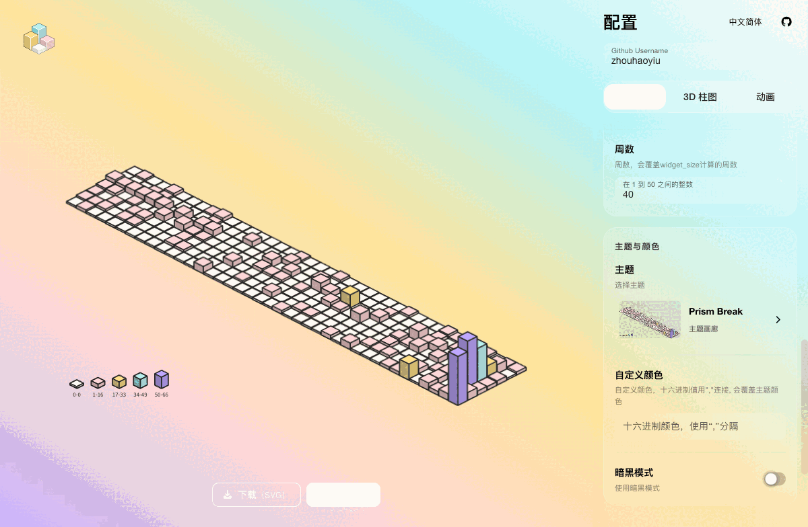

<div align="center">
  <h1>ssr-contributions-img</h1>
  <p>把 GitHub 贡献记录渲染成可嵌入 README、个人主页和小组件的 SVG 图表。</p>
  <p>
    <strong>简体中文</strong>
    ·
    <a href="./README-EN.md">English</a>
    ·
    <a href="./README-JA.md">日本語</a>
  </p>
  <p>
    <a href="https://ssr-contributions-img.zhouhaoyiu.workers.dev/health">在线服务</a>
    ·
    <a href="#快速使用">快速使用</a>
    ·
    <a href="#配置项">配置项</a>
    ·
    <a href="#本地运行">本地运行</a>
  </p>
  <picture>
    <source media="(prefers-color-scheme: dark)" srcset="https://ssr-contributions-img.zhouhaoyiu.workers.dev/_/zhouhaoyiu?chart=3dbar&amp;format=svg&amp;weeks=42&amp;animation=wave&amp;theme=prism_break&amp;dark=true&amp;gradient=true&amp;legend=true&amp;legendPosition=bottom&amp;legendDirection=row">
    <source media="(prefers-color-scheme: light)" srcset="https://ssr-contributions-img.zhouhaoyiu.workers.dev/_/zhouhaoyiu?chart=3dbar&amp;format=svg&amp;weeks=42&amp;animation=wave&amp;theme=prism_break&amp;dark=false&amp;gradient=true&amp;legend=true&amp;legendPosition=bottom&amp;legendDirection=row">
    
  </picture>
</div>

## 功能

- `calendar` 和 `3dbar` 两种图表
- 53 套预设主题，也可以传入自定义十六进制色板
- `fall`、`raise`、`wave`、`mess`、`spin`、`fadeIn` 六种 SVG 动画
- 3D 柱体渐变、图例、描边、光照、间距和扁平化设置
- Cloudflare Worker 在线 SVG 接口
- Nest API 支持 `svg`、`xml`、`html`、`png`、`jpeg`
- Vue Playground 实时预览、切换主题、下载 SVG 和复制链接

## 快速使用

在线 Worker 地址：

```text
https://ssr-contributions-img.zhouhaoyiu.workers.dev/_/{username}?{queryString}
```

最小示例：

```text
https://ssr-contributions-img.zhouhaoyiu.workers.dev/_/zhouhaoyiu?chart=3dbar&format=svg
```

放进 GitHub README：

```md

```

把 URL 中的 `zhouhaoyiu` 换成其他 GitHub 用户名即可。Worker 对响应缓存 5 分钟，GitHub 自己的图片代理也可能继续缓存一段时间。

## Playground

Vue Playground 可以预览图表、切换主题、调整参数、下载 SVG 和复制链接。

<picture>
  <source media="(prefers-color-scheme: dark)" srcset="./assets/screenshots/playground-zh-dark.gif">
  <source media="(prefers-color-scheme: light)" srcset="./assets/screenshots/playground-zh-light.gif">
  
</picture>

## 示例展示

### GitHub 风格日历

```text
https://ssr-contributions-img.zhouhaoyiu.workers.dev/_/zhouhaoyiu?chart=calendar&format=svg&weeks=50&theme=native
```

<picture>
  <source media="(prefers-color-scheme: dark)" srcset="https://ssr-contributions-img.zhouhaoyiu.workers.dev/_/zhouhaoyiu?chart=calendar&amp;format=svg&amp;weeks=50&amp;theme=native&amp;dark=true">
  <source media="(prefers-color-scheme: light)" srcset="https://ssr-contributions-img.zhouhaoyiu.workers.dev/_/zhouhaoyiu?chart=calendar&amp;format=svg&amp;weeks=50&amp;theme=native&amp;dark=false">
  
</picture>

### 带动画和图例的 3D 柱图

```text
https://ssr-contributions-img.zhouhaoyiu.workers.dev/_/zhouhaoyiu?chart=3dbar&format=svg&weeks=42&theme=prism_break&gradient=true&strokeWidth=1&legend=true&legendPosition=bottom&legendDirection=row&animation=wave
```

<picture>
  <source media="(prefers-color-scheme: dark)" srcset="https://ssr-contributions-img.zhouhaoyiu.workers.dev/_/zhouhaoyiu?chart=3dbar&amp;format=svg&amp;weeks=42&amp;theme=prism_break&amp;gradient=true&amp;strokeWidth=1&amp;legend=true&amp;legendPosition=bottom&amp;legendDirection=row&amp;animation=wave&amp;dark=true">
  <source media="(prefers-color-scheme: light)" srcset="https://ssr-contributions-img.zhouhaoyiu.workers.dev/_/zhouhaoyiu?chart=3dbar&amp;format=svg&amp;weeks=42&amp;theme=prism_break&amp;gradient=true&amp;strokeWidth=1&amp;legend=true&amp;legendPosition=bottom&amp;legendDirection=row&amp;animation=wave&amp;dark=false">
  
</picture>

### 自定义色板

`colors` 会覆盖 `theme`。颜色可以省略 `#`，用逗号分隔：

```text
https://ssr-contributions-img.zhouhaoyiu.workers.dev/_/zhouhaoyiu?chart=3dbar&format=svg&weeks=36&colors=0b132b,1c2541,3a506b,5bc0be,6fffe9&gradient=true
```

### 动画效果示例

<table>
  <tr>
    <th><code>fall</code></th>
    <th><code>raise</code></th>
    <th><code>wave</code></th>
  </tr>
  <tr>
    <td></td>
    <td></td>
    <td></td>
  </tr>
</table>

### 两种扁平模式

<table>
  <tr>
    <th><code>flatten=1</code></th>
    <th><code>flatten=2</code></th>
  </tr>
  <tr>
    <td></td>
    <td></td>
  </tr>
</table>

## 两种运行方式

| 能力 | Cloudflare Worker | Nest API |
| --- | --- | --- |
| 适合场景 | GitHub README、个人主页、公开图片链接 | Playground、完整 API、自部署 |
| 图表路由 | `/_/:username`、`/svg/:username` | `/_/:username`、`/svg/:username` |
| 输出格式 | 始终返回 SVG | `svg`、`xml`、`html`、`png`、`jpeg` |
| 其他接口 | `/health` | `/themes`、`/config`、`/contributions/:username` |
| 在线地址 | `ssr-contributions-img.zhouhaoyiu.workers.dev` | 本地或自行部署 |

Worker 会直接读取 GitHub 公开贡献页。Nest API 也优先读取公开贡献页，失败时可使用 `GITHUB_PAT` 走 GraphQL 回退。

## 配置项

所有参数都放在 URL 查询字符串中。布尔值使用 `true` 或 `false`，颜色建议去掉 `#`，避免 URL 片段符号影响解析。

共 28 个查询参数，完整分组如下。

| 分组 | 数量 | 参数 |
| --- | ---: | --- |
| 通用 | 9 | `chart`、`theme`、`colors`、`dark`、`widget_size`、`weeks`、`tz`、`format`、`quality` |
| 3D 柱图 | 11 | `gap`、`scale`、`light`、`gradient`、`flatten`、`legend`、`legendPosition`、`legendDirection`、`foregroundColor`、`strokeWidth`、`strokeColor` |
| 动画 | 8 | `animation`、`animation_duration`、`animation_delay`、`animation_amplitude`、`animation_frequency`、`animation_wave_center`、`animation_loop`、`animation_reverse` |

`tz` 通过 URL 直接设置；`animation_loop` 和 `animation_reverse` 只在对应动画模式中出现，因此 Playground 不会同时显示全部 28 项。

### 通用参数

| 参数 | 可用值 | 默认值 | 说明 |
| --- | --- | --- | --- |
| `chart` | `calendar`、`3dbar` | Worker: `3dbar`；Nest: `calendar` | 图表类型 |
| `theme` | 预设主题、`random` | `green` | `random` 每次随机选一套色板 |
| `colors` | 逗号分隔的十六进制颜色 | 未设置 | 自定义色板，设置后覆盖 `theme` |
| `dark` | `true`、`false` | `false` | 使用主题的深色版本 |
| `widget_size` | `small`、`medium`、`large` | `medium` | 自动选择展示周数，分别对应 7、16、40 周 |
| `weeks` | `1` 到 `50` | 由 `widget_size` 决定 | 手动指定周数，并覆盖 `widget_size` |
| `tz` | IANA 时区，例如 `Asia/Shanghai` | `Asia/Shanghai` | 计算当前日期时使用的时区 |
| `format` | `svg`、`xml`、`html`、`png`、`jpeg` | Nest: `html` | Worker 始终返回 SVG；其他格式只在 Nest API 生效 |
| `quality` | `0.1` 到 `10` | `1` | PNG/JPEG 的输出倍率，数值越大图片越大 |

### 3D 柱图参数

这些参数只对 `chart=3dbar` 生效。

| 参数 | 可用值 | 默认值 | 说明 |
| --- | --- | --- | --- |
| `gap` | `0` 到 `20` | `1.2` | 立方体之间的间距 |
| `scale` | 大于等于 `1` | `2` | 调整 3D 俯视倾斜比例；Playground 上限为 100 |
| `light` | `1` 到 `60` | `10` | 立方体明暗差 |
| `gradient` | `true`、`false` | `false` | 使用渐变填充 |
| `flatten` | `0`、`1`、`2` | `0` | `0` 保留高度，`1` 全部扁平，`2` 扁平但忽略空格 |
| `legend` | `true`、`false` | `false` | 显示贡献等级图例；兼容旧参数名 `lengend` |
| `legendPosition` | `top`、`right`、`bottom`、`left`、`topRight`、`bottomLeft` | `right` | 图例位置 |
| `legendDirection` | `row`、`column` | `column` | 图例横向或纵向排列 |
| `foregroundColor` | 十六进制颜色 | 自动 | 图例文字颜色；浅色默认 `#222`，深色默认 `#ddd` |
| `strokeWidth` | `0` 到 `20` | `0` | 立方体描边宽度，`0` 表示关闭 |
| `strokeColor` | 十六进制颜色 | 自动 | 描边颜色；只传颜色时，描边宽度自动使用 `1` |

### 动画参数

动画只对 3D SVG 生效。Nest API 输出 PNG/JPEG 时会自动移除动画。

| 参数 | 可用值或格式 | 默认值 | 说明 |
| --- | --- | --- | --- |
| `animation` | `fall`、`raise`、`wave`、`mess`、`spin`、`fadeIn`、`none` | 未设置 | 动画类型 |
| `animation_duration` | 秒数 | 取决于动画 | 单次动画时长 |
| `animation_delay` | 秒数 | 取决于动画 | 每个方块之间的延迟 |
| `animation_amplitude` | 像素数 | `10` | `wave` 的垂直振幅 |
| `animation_frequency` | `0.01` 到 `0.5` | `0.05` | `wave` 的频率 |
| `animation_wave_center` | `周索引_星期索引`，例如 `19_3` | `0_0` | `wave` 的扩散中心 |
| `animation_loop` | `true`、`false` | `false` | 让 `mess` 或 `spin` 循环播放；`wave` 本身会循环 |
| `animation_reverse` | `true`、`false` | `false` | 反向播放 `fadeIn` 的方块顺序 |

未传时间参数时，渲染器会使用各动画自己的内置值：`fall`/`raise` 为 1 秒，`wave`、`mess`、`spin` 为 3 秒，`fadeIn` 为 0.5 秒。

### 主题列表

提供 53 套固定主题，另有 `random` 随机模式。

<details>
  <summary>查看全部主题名</summary>

基础主题：

```text
green, dark_green, red, purple, blue, yellow, cyan, yellow_wine, pink, sunset, native
```

扩展主题：

```text
purple_nebula, blue_orbit, sunset_ember, teal_lagoon, rose_pulse,
amber_forge, emerald_canopy, cyan_depth, indigo_night, mono_slate,
neon_horizon, aurora_drift, lava_surge, frost_byte, acid_rain,
volt_riot, toxic_glitch, plasma_storm, chrome_pulse, cyber_sakura,
obsidian_bloom, desert_mirage, hologram_pop, circuit_bronze, lotus_eclipse,
tropic_burst, deco_nights, supernova_crash, vaporwave_dream, quantum_leap,
dragonfire_scales, halloween_pumpkin, nordic_frost, cosmic_latte, tokyo_night,
autumn_maple, laser_grid, blacklight, prism_break, matrix_rain,
solar_flare, ocean_reactor
```

</details>

在完整 Nest API 中访问下面两个地址，可以一次查看全部主题：

```text
http://localhost:3000/themes?format=svg
http://localhost:3000/themes?format=svg&dark=true
```

## 本地运行

要求：Node.js `22.x` 或 `25.x`，pnpm `11.9.0`。

```shell
pnpm install
```

终端 1，启动 Nest API。`PLAYGROUND_ALLOWED_ORIGINS` 必须包含 Playground 的浏览器地址，否则数据接口会返回 `403 Origin not allowed`。

```shell
PLAYGROUND_ALLOWED_ORIGINS=http://localhost:5173 SERVER_PORT=3000 pnpm start:dev
```

终端 2，启动 Vue Playground：

```shell
VITE_DEV_SERVER_PROXY_TARGET=http://localhost:3000 pnpm -C playground dev
```

然后打开 `http://localhost:5173`。直接访问 API 的例子：

```text
http://localhost:3000/_/zhouhaoyiu?chart=3dbar&format=svg&weeks=40&theme=prism_break
```

### 环境变量

| 变量 | 默认值 | 说明 |
| --- | --- | --- |
| `SERVER_PORT` | `3000` | Nest API 监听端口 |
| `GITHUB_PAT` | 未设置 | 可选，仅用于 GitHub 公开贡献页不可用时的 GraphQL 回退和诊断 |
| `PLAYGROUND_ALLOWED_ORIGINS` | 未设置 | 允许访问 Playground 数据接口的来源，多个地址用逗号分隔 |
| `PLAYGROUND_DATA_RATE_LIMIT_MAX` | `30` | 单个 IP/用户名在一个窗口内的请求上限 |
| `PLAYGROUND_DATA_RATE_LIMIT_WINDOW_MS` | `60000` | 限流窗口，单位毫秒 |
| `PLAYGROUND_DATA_CACHE_TTL_MS` | `300000` | 贡献数据和渲染结果缓存时间，单位毫秒 |

### 构建与测试

```shell
pnpm build
pnpm test --runInBand
```

## 部署

Cloudflare Worker 入口是 `worker/index.ts`，配置见 `wrangler.toml`。Worker 适合公开 SVG 图片链接，根路径会跳转到仓库主页。

Nest/Vercel 入口是 `api/index.ts`，配置见 `vercel.json`。需要 PNG、JPEG、HTML、主题总览或完整 Playground API 时使用这一部署方式。

## 致谢

感谢 [CatsJuice/ssr-contributions-img](https://github.com/CatsJuice/ssr-contributions-img) 提供原始开源实现。3D 柱图的实现思路见作者的 [Medium 文章](https://medium.com/@catsjuice/fake-3d-bar-chart-with-svg-js-134684bd5100) 和 [CodePen 示例](https://codepen.io/catsjuice/pen/MWVqNdQ)。

## License

[MIT](./LICENSE)
